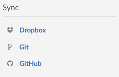

OverleafはTeXをオンラインで編集~コンパイルまでできるスグレモノです．
特に複数人でプロジェクトを管理できるので，私の場合は雛形を共有されてそれを編集するみたいなパターンが多いです．
しかし，バージョン管理が「更新履歴」のような単純なもので，扱いが難しいです．
今回はかわりにローカルのGitでバージョン管理しoverleafにpushする方法を試してみたのでそのときのメモです．
<!--truncate-->

## Git連携とGitHub連携

Overleafのプロジェクトに入って左上のMenuを押すとこんな感じのメニューが表示されます．

GitとGitHub連携があり，それぞれ以下の特徴があります．

- Git
  - プロジェクトのオーナーがサブスクしていれば無料で使える．
  - Githubのアカウントを作る必要がない
  - ローカルリポジトリから`push`するときに毎回アカウント情報を求められる．
- GitHub
  - 自分がサブスクしていないと使えない．
  - GitHubの色々な機能が使える．
  - overleaf側の認証は最初だけであとはGitHubにpushすればよい．

こんな感じでどちらも善し悪しがあります．

私としてはプロジェクトのオーナーがサブスクしている状態だったので無料で使えるGitを使用したかったのですが，
毎回overleaf用のメアドとパスワードを入れるのが面倒だったので大人しくサブスク契約してGitHub連携に変更しました．

## GitHub連携の方法

だいたい[ここ](https://www.overleaf.com/learn/how-to/GitHub_Synchronization)に書いてありますが，
1. 先程のメニューからGitHubを選択するとGitHubにログインするように促されるのでボタンをポチってログイン．
2. overleafに戻ってもう一度GitHubを選択する．
3. GitHub Syncの画面が出てきてリポジトリの名前とかを決めてCreate Reposityoryする．
4. ローカルのGitから`git clone`で該当のリポジトリをもってくる．

あとは作業の後，GitHubに`push`して，もう一度Overleafの画面を確認すると，

こんな感じのボタンが出てくるので`Pull`のほうを選択すればOverleafに変更を取り込めます．
逆に他の人が変更した内容をリポジトリに反映したければ`Push`をおせばOK．

## ここまでするなら直接GitHubでホストすればよくない？

**それをいってはいけない**
